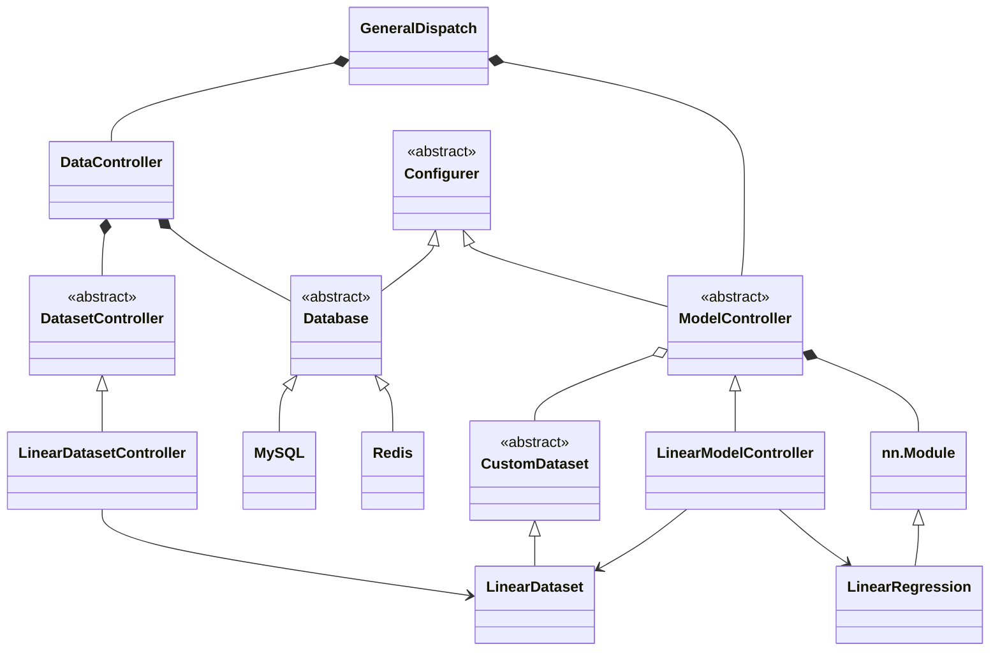

# 🌸Simple·AI：极简 AI-Web 开发框架


## 📌0 目录

- [🌸Simple·AI：极简 AI-Web 开发框架](#simpleai极简-ai-web-开发框架)
  - [📌0 目录](#0-目录)
  - [✨1 简介](#1-简介)
  - [📦2 下载安装\&快速开始](#2-下载安装快速开始)
  - [🧭3 框架结构\&开发指南](#3-框架结构开发指南)
    - [🧩3.1 架构总览](#31-架构总览)
    - [🏗️3.2 核心模块概览\&开发指引](#️32-核心模块概览开发指引)
      - [🐍3.2.1 src/app.py](#321-srcapppy)
      - [📁3.2.2 src/control/](#322-srccontrol)
      - [📁3.2.3 src/database/](#323-srcdatabase)
      - [📁3.2.4 src/module/](#324-srcmodule)
      - [📁3.2.5 src/dataset/](#325-srcdataset)
      - [📁3.2.6 src/utils/](#326-srcutils)
      - [📁3.2.7 resource/](#327-resource)
      - [📁3.2.8 config/](#328-config)
    - [🔁3.3 扩展开发原则](#33-扩展开发原则)
  - [🔍4 以 LinearRegression 为例说明开发流程](#4-以-linearregression-为例说明开发流程)
    - [📊4.1 包装数据](#41-包装数据)
    - [📐4.2 开发模型](#42-开发模型)
    - [🔀4.3 集成控制](#43-集成控制)
    - [🌐4.4 编写路由](#44-编写路由)
  - [📜5 许可证\&关于作者](#5-许可证关于作者)

</br>

> ⚡ **快速导航：**
>
> - 想快速上手？查阅第2、4节
> - 想深入了解？查阅第3节

## ✨1 简介

**Simple·AI提供开箱即用的AI服务化解决方案** - 不仅仅是训练框架，而是集成了模型开发、Web服务、业务逻辑的完整生产级架构。

💫 **特点：**

- **轻量骨架，无限扩展**：仅定义清晰的插件接口，不绑定任何技术栈，一切由你决定
- **端到端集成**：PyTorch模型 + Web API + 业务控制器，无需额外配置
- **模块化设计**：清晰的控制器模式，模型、数据、业务逻辑完全解耦
- **配置驱动**：JSON配置管理，轻松切换实验和生产环境
- **多数据库支持**：MySQL、Redis、Faiss统一抽象接口
- **完整工具链**：内置训练器、持久化器、早停策略等生产工具

🎯 **适合人群：**

- **AI初学者**：想了解从模型训练到API部署的全流程
- **全栈开发者**：需要快速构建AI驱动的Web应用
- **教育/研究者**：寻找完整的项目架构教学示例
- **创业团队**：需要快速原型验证AI想法

✅ **解决问题：**

- "我训练了模型，但不知道怎么做成服务"
- "我的AI代码混乱，难以维护和扩展"
- "想学习工业界AI项目架构，但找不到简单示例"
- "需要快速验证AI业务想法，不想从零搭建"

📊 **框架对比：**

|    特性维度     | Simple·AI    | PyTorch Lightning | fast.ai | 说明          |
|:-----------:|--------------|-------------------|---------|-------------|
| **内置Web服务** | ✅ 专为Web微服务开发 | ❌ 需额外开发           | ⚠️ 简单实现 | **开箱即用API** |
|  **业务架构**   | ✅ 控制器模式      | ❌ 专注训练            | ❌ 过度封装  | **贴近真实项目**  |
|  **数据库抽象**  | ✅ 多存储支持      | ❌ 无               | ❌ 无     | **生产就绪**    |
|  **配置管理**   | ✅ JSON配置     | ✅ YAML配置          | ✅ ini配置 | 同等优秀        |
|  **学习曲线**   | 🟡 中等        | 🔴 较陡             | 🟢 平缓   | **平衡学习价值**  |
|  **部署复杂度**  | 🟢 简单        | 🟡 中等             | 🟢 简单   | **单机友好**    |
|   **扩展性**   | ✅ 模块化        | ✅ 优秀              | ⚠️ 有限   | **易于添加新模型** |
|  **教学价值**   | ✅ 极高         | ✅ 高               | ⚠️ 一般   | **透明架构设计**  |

**如果你苦于只会训练模型而不知如何部署，Simple·AI将带你完成从实验到产品的全流程体验！**

## 📦2 下载安装&快速开始

1. **从GitHub克隆本项目**

   ```commandline
   git clone git@github.com:7DaysWithU/SimpleAI.git
   ```

2. **安装python依赖**

   首先安装GPU版本的PyTorch。因GPU版本的PyTorch不能通过pip直接下载，且具体版本依赖于用户的GPU型号与CUDA版本，请自行选择合适的PyTorch版本进行安装。以下命令为torch==2.1.0+cu121的安装命令

   ```commandline
   pip install torch==2.1.0 torchvision==0.16.0 torchaudio==2.1.0 -f https://mirrors.aliyun.com/pytorch-wheels/cu121/
   ```

   然后安装其他依赖：

   ```commandline
   pip install -r requirements.txt -i https://mirrors.aliyun.com/pypi/simple/
   ```

3. **运行**

   - **本地运行**：运行`SimpleAI/test/test.py`文件，文件内容即为使用示例  
   - **HTTP微服务运行**
     - 运行`SimpleAI/src/app.py`文件。文件内容即为使用示例的`Flask`微服务包装
     - 按 **先后顺序** 发出如下HTTP请求(可选用Postman或`Flask.test_client()`)
       - `POST /api/SimpleAI/config HTTP/1.1`
       - `POST /api/SimpleAI/load HTTP/1.1`
       - `GET /api/SimpleAI/predict/10.0 HTTP/1.1`

   </br>

   > 两种运行方法均为同一个示例，即在线性数据集 y = 2.5 * x + 1.0 的关系下预测 x=10.0 时 y 的值

## 🧭3 框架结构&开发指南

### 🧩3.1 架构总览

```Text
SimpleAI/
│
├── config/                    # 配置目录(用户按需修改)
│
├── resource/                  # 资源根目录
│   ├── static/                # 静态资源(原始数据文件等)
│   └── dynamic/               # 运行时产物(保存的模型、预训练权重、索引等)
│
├── src/                       # 源代码目录
│   ├── app.py                 # 微服务入口与路由注册
│   ├── control/               # 控制器层
│   ├── module/                # 模型实现
│   ├── dataset/               # 数据集实现
│   ├── database/              # 可选数据源适配器(含 Redis/MySQL 示例)
│   ├── utils/                 # 通用工具(配置、模型训练、持久化、异步任务队列等)
│   ├── data_process/          # 可选数据源预处理工具(含离散化、词频分析示例)
│   └── common/                # 通用方法/类(装饰器、枚举类、异常类等)
│
└── test/                      # 测试目录
```



- 🎯 **核心设计理念**

  框架遵循“控制器模式”，实现**数据管理、模型逻辑、业务服务三层解耦**：

  - **数据层**：通过统一的接口访问不同数据源(文件、MySQL、Redis等)
  - **模型层**：专注于PyTorch模型本身，无框架侵入
  - **服务层**：将模型能力封装为标准Web API

- 📖 **类图解读**
  - 🔧 **控制中枢(最上层)**
  
    - **GeneralDispatch**：服务总控，Flask路由的最终调用入口
    - **DataController**：数据总控，统一管理所有数据源的访问
  
    **设计意图**：将请求调度与数据管理分离，确保服务入口简洁，数据操作规范。
  
  - 📦 **抽象基类(中间层)**
  
    - **Configurer**：配置管理抽象，为所有需要配置的组件提供统一接口
    - **Database**：数据库抽象，定义数据持久化的标准方法(connect/close)
    - **CustomDataset**：数据集抽象，遵循PyTorch Dataset规范
    - **DatasetController**：数据集控制器抽象，封装特定数据集的业务逻辑
    - **ModelController**：模型控制器抽象，定义模型生命周期的标准操作
  
    **设计意图**：通过抽象基类确立框架的扩展规范，确保新增组件遵循一致的设计模式。
  
  - 🛠️ **具体实现(下层)**
  
    - **MySQL/Redis**：Database的具体实现，展示如何适配不同数据源
    - **LinearDataset**：CustomDataset的具体实现，示例数据集
    - **LinearRegression**：PyTorch模型的具体实现
    - **LinearDatasetController/LinearModelController**：控制器具体实现
  
    **设计意图**：提供可运行的示例，用户参照这些实现快速创建自己的组件。
  
  - 🔗 **关键关系说明**
  
    - **继承关系(垂直箭头)**
      - `Configurer ← Database/ModelController`：配置能力基础
      - `Database ← MySQL/Redis`：多数据库支持
      - `CustomDataset ← LinearDataset`：数据集扩展
      - `ModelController ← LinearModelController`：模型控制器扩展

      **设计意图**：强制一致的接口，确保组件可替换、系统可预测。

    - **组合关系(菱形箭头)**
      - `GeneralDispatch *-- DataController`：服务入口聚合数据管理
      - `GeneralDispatch *-- ModelController`：服务入口聚合模型控制
      - `DataController *-- DatasetController/Database`：统一数据访问
      - `ModelController *-- nn.Module`：持有具体模型实例

      **设计意图**：建立清晰的依赖关系，避免循环依赖，确保模块可独立测试。

    - **使用关系(虚线箭头)**
      - `LinearModelController --> LinearDataset/LinearRegression`：具体实现的使用关系
  
      **设计意图**：展示具体业务场景中组件如何协作。

### 🏗️3.2 核心模块概览&开发指引

#### 🐍3.2.1 src/app.py

Web服务的唯一入口。用户可根据自身需求选择合适的Web框架，并在`app.py`中编写调用路由。提供的示例使用了Flask

`app.py`中的调用路由应统一使用`GeneralDispatch`类的实例，将HTTP调用转交为对应的业务和数据操作

#### 📁3.2.2 src/control/

控制层是框架的**调度中枢**，负责协调模型、数据与外部请求，所有业务逻辑通过插件式控制器接入，**核心流程不依赖具体实现**。

- 🐍 **GeneralDispatch.py**

  服务总控类，作为**唯一对外暴露的调用入口**。Web层(`app.py`)只需调用`GeneralDispatch`类的实例中的方法，即可触发对应业务或数据操作。示例给出了基本方法，用户可按需开发，仅需确保每个HTTP请求都能转化为对`GeneralDispatch`类实例中方法的组合调用即可

  `GeneralDispatch`类聚合：
  - 一个`DataController`类实例，用于统一管理数据访问
  - 多个`ModelController`子类实例，用于统一执行模型操作(如训练、推理等)

- 🐍 **DataController.py**

  数据总控类，负责实现各种数据`get()`与`set()`的接口，用于在请求生命周期内安全传递中间数据(如数据集、缓存内容等)。**不持有全局状态**，实例由`GeneralDispatch`创建

  `DataController`类聚合：
  - 多个`Database`子类实例，用于读写各类外部数据源(如MySQL、MongoDB、Redis、Faiss等)
  - 多个`DatasetController`子类实例，用于获得标准化数据集实例

- 📁 **model_controller/**

  存放**模型控制器(`ModelController`子类)**。每个模型对应一个模型控制类，模型控制类必须继承 `ModelController` 基类，并实现基类中规定的`@abstractmethod`方法。
  
  框架遵循依赖倒转原则，支持多模型并存。

- 📁 **dataset_controller/**
  
  存放**数据集控制器(`DatasetController`子类)**。每个数据集对应一个数据集控制类，数据集控制类必须继承 `DatasetController` 基类，并实现基类中规定的`@abstractmethod`方法(即`get_dataset()`方法)，返回符合`CustomDataset`基类的数据集实例，供模型控制器按需调用。

  数据集控制类的核心是通过`get_dataset()`方法返回可用的数据集实例，因此数据集控制类内的其他方法用于处理传递给数据集控制类的**原始数据**，使之符合需求

#### 📁3.2.3 src/database/

存放**数据库适配器(`Database`子类)**。每个数据源对应一个数据库适配类，数据库适配类必须继承 `Database` 基类，并实现基类中规定的`@abstractmethod`方法

数据库适配类用于提供对应数据源的连接、释放与操作方法。示例提供了MySQL、Redis、Faiss和LocalData的基本实现

#### 📁3.2.4 src/module/

存放**自定义模型(`nn.Module`子类)**。每个自定义模型必须继承 `nn.Module` 基类，并实现基类中规定的`@abstractmethod`方法(即`forward()`方法)

自定义模型作为框架的算法底层，负责定义推理的计算逻辑，不包含业务协调或数据加载职责，确保与控制层完全解耦。

#### 📁3.2.5 src/dataset/

存放**自定义数据集(`CustomDataset` 子类)**。每个数据集必须继承`CustomDataset`基类，该基类同时继承`ABC`与PyTorch的`Dataset`，要求子类实现`__getitem__()`方法以支持索引访问，并可选择性重写`__len__()`；此外，所有子类均可直接使用基类提供的静态方法`train_test_split()`实现标准化的数据划分。

自定义数据集作为数据输入的底层单元，封装**处理后数据**的加载与组织逻辑，不涉及业务控制或模型交互，确保与控制器和模型完全解耦。

#### 📁3.2.6 src/utils/

- 🐍 **Trainer.py**

  提供通用模型训练器 `Trainer` 类，封装 PyTorch 训练循环、验证评估、早停策略、损失记录与模型保存等生产级功能；用户只需传入模型、优化器和损失函数即可启动训练，支持监督/无监督模式、检查点保存、损失曲线绘制及自定义早停条件，无需重复编写训练样板代码。

- 🐍 **Stopper.py**

  实现早停(Early Stopping)机制，通过监控验证损失自动终止训练；用户可配置最大容忍轮次(`trials`)，避免过拟合并节省计算资源

- 🐍 **Loader.py**

  封装数据集分割与`DataLoader`构建逻辑，接收`CustomDataset`实例并按指定比例(`train_ratio`)和批大小(`batch_size`)生成训练/测试加载器，简化数据管道搭建

- 🐍 **Configurer.py**

  提供配置注入基类，要求子类实现`configure()`方法；框架自动从`settings.json`加载对应配置项并赋值给已声明的类属性，支持路径自适应与模型状态字典过滤(state_dict filter)

- 🐍 **Persistencer.py**

  实现运行时内存级单例持久化容器，用于在请求或任务生命周期内安全暂存对象(如模型实例、连接句柄)；通过键值对管理，支持线程安全的增删查操作。

- 🐍 **task.py**

  提供异步长任务管理功能，通过`@TaskManager.long_task`装饰器注册耗时的长任务，支持任务提交、状态追踪(PENDING / PROGRESS / SUCCESS / FAILURE)与结果获取，适用于训练、批量推理等后台作业。

#### 📁3.2.7 resource/

- 📁 **dynamic/**

  存放运行时生成的产物，如训练保存的模型权重、索引文件、缓存数据等；内容由框架或用户逻辑在执行过程中写入，通常不纳入版本控制

- 📁 **static/**

  存放原始静态资源，如原始数据文件、预置词表等；内容在服务启动前准备就绪，运行期间只读，建议纳入版本管理或与代码一同分发

#### 📁3.2.8 config/

配置目录，存放各类配置文件。框架启动时自动加载，所有继承`Configurer`的组件将从中提取对应配置子树

### 🔁3.3 扩展开发原则

SimpleAI采用 **"基于约定，而非配置"** 的设计哲学。扩展框架功能时，只需遵循明确的约定即可无缝集成

- **契约优于约定**

  所有扩展必须继承指定抽象基类(如`ModelController`、`Database`)，并实现其`@abstractmethod`方法。框架只认接口，不认实现(依赖倒转原则)

  > 💡 **"三个一"原则：**
  > - *一个新模型：* 需要创建一个新的模型类(继承nn.Module)和一个新的模型控制器类(继承ModelController)
  > - *一个新数据集：* 需要创建一个新的数据集类(继承CustomDataset)和一个新的数据集控制器类(继承DatasetController)
  > - *一个新数据库：* 需要创建一个新的数据库客户端类(继承Database)

- **配置驱动，而非硬编码**

  任何可变参数(路径、超参、开关)都应通过`settings.json`注入，继承`Configurer`即可自动获得对应配置子树

- **关注点分离**
  - 模型(`module/`)只负责计算逻辑  
  - 数据集(`dataset/`)只负责数据集组织  
  - 控制器(`control/`)只负责协调流程  
   **禁止跨层直接调用**(如模型内访问数据库)

## 🔍4 以 LinearRegression 为例说明开发流程

### 📊4.1 包装数据

- **数据库适配器**

  数据文件位于`resource/static/linear_data.csv`，**数据源是本地文件**，因此在`src/database`中新建`LocalData.py`，并在其中新建`LocalData`类，继承基类`Database`。对于本地文件系统，`connect()`和`close()`方法可选择空置(但必须实现这两个方法)。`configure()`方法中使用`Configurer`类的`load_configuration()`方法读取`settings.json`中传递的配置字典。由于示例简单，只需实现`get_linear_data()`读取csv文件内容并返回即可
  
  **特别地，文件路径应采用变量`self.local_data_file_path`，以便未来路径发生变动时可直接通过配置文件`setting.json`进行修改，符合开闭原则**。对该种变量，应同步在`settings.json`中增加**与变量名相同的字段(`"local_data_file_path"`)**

  对于复杂的数据文件，数据源获取数据时可稍作简单处理。如MySQL可使用筛选功能选择符合条件的内容。但数据源处的处理能力较为有限

- **自定义数据集**

  在`src/dataset`中新建`LinearDataset.py`，并新建`LinearDataset`类，继承基类`CustomDataset`，实现要求的方法`__getitem__()`。由于数据集只有x和y两列，因此第一列作为x，第二列作为y，返回两个`torch.Tensor`

  对于复杂的数据集，可在自定义数据集中实现更复杂的分割方法

- **数据集控制器**

  在`src/control/dataset_controller`中新建`LinearDatasetController.py`，并新建`LinearDatasetController`类，继承基类`DatasetController`，实现要求的方法`get_dataset()`。由于获得原始数据依赖`LocalData`类，而`LinearDatasetController`类应专注于处理数据集，因此将原始数据`data`作为类属性，实现其`setter()`和`getter()`方法，在更高层的抽象中传递

  对于复杂的数据集，数据集控制器将承担大量的数据预处理任务，如离散化、统计等。因此在数据集控制类中可实现对应的预处理方法。此外，数据集的生成可能依赖控制参数，则可通过`get_dataset()`方法根据不同参数进行不同处理，屏蔽底层的处理细节，只暴露返回数据集实例的接口

- **数据总控**

  首先在数据总控`DataController`类的`__init__()`方法中注册数据库适配器`LocalData`类和数据集控制器`LinearDatasetController`类的实例。并实现`get_LinearDataset()`的总控方法。在该方法中，首先通过`LocalData`实例获得原始数据，再将原始数据传递给`LinearDatasetController`实例，最终调用`LinearDatasetController`实例的`get_dataset()`方法获得数据集实例

  在总控方法`get_LinearDataset()`中可额外实现多数据源的配置，如设置Redis优化、将数据库数据持久化到本地文件等。此外，对于复杂的数据集，获取数据集时可能需要其他控制参数，也可通过总控方法的扩展将参数传递给数据集控制类

- **小结**

  **数据流动路径(从原始文件到可用数据集示例)：**

  ```Text
  resource/static/linear_data.csv
  ↓
  [LocalData]               # 读取原始文件(路径由 settings.json 配置)
  ↓
  原始 DataFrame / 数组
  ↓
  [LinearDatasetController] # 可选预处理(如归一化、分列、参数化构造)
  ↓
  [LinearDataset]           # 封装为 torch.Dataset，支持 __getitem__
  ↓
  DataController.get_LinearDataset()
  ↓
  → 可被 ModelController 直接用于训练或推理
  ```

  **每层封装增加的能力：**

  | 层级 | 能力增强 |
  |------|--------|
  | **数据库适配器(`LocalData`)** | 统一数据源访问接口，支持配置驱动的路径管理 |
  | **自定义数据集(`LinearDataset`)** | 转换为PyTorch兼容格式，支持`DataLoader`加载 |
  | **数据集控制器(`LinearDatasetController`)** | 执行数据预处理逻辑，屏蔽复杂性，支持参数化生成 |
  | **数据总控(`DataController`)** | 协调多组件协作，提供高层“一键获取”接口 |

  > ✅ **核心思想**：每一层只做一件事，但组合起来形成灵活、可配置、可扩展的数据管道。

### 📐4.2 开发模型

- **自定义模型**

  在`src/module`中新建`LinearRegression.py`，并新建`LinearRegression`类，继承基类`nn.Module`，实现要求的方法`forward()`。模型类只需专注模型设计即可，与业务、数据解耦

- **模型控制器**

  在`src/control/model_controller`中新建`LinearController.py`，并新建`LinearController`类，继承基类`ModelController`，实现所有要求的方法：

  | 方法名 | 核心职责 | 实现要求 |
  |--------|--------|---------|
  | `load_data(dataset)` | 加载并预处理原始数据集 | 将传入的数据集实例转换为训练/测试所需`DataLoader`实例，并以类属性保存 |
  | `load_model_into_memory()` | 加载已训练好的模型 | 从磁盘(如 `.pth` 文件)或缓存中加载完整模型到内存，赋值给`self.pretrained_model`<ul><li>**`ModelSaveMode.FRAME`**：完整保存的模型，可直接用于推理</li><li>**`ModelSaveMode.STATE`**：仅保存了参数的模型，用以增量训练</li></ul> |
  | `train(*args, **kwargs)` | 完整训练流程 | 包含数据准备、模型定义、模型训练、验证评估及模型保存，支持通过配置或参数控制行为 |
  | `eval()` | 模型性能评估 | 计算指标(如 MSE、Accuracy)、生成可视化函数(如绘图回调)，返回可调用对象供上层使用 |
  | `use(**data)` | 执行业务推理 | 接收用户输入数据，调用模型进行预测/生成，返回结果(如标量、向量、JSON 等) |

  其中，`__init__()`中的设置参数和模型参数应同步在`settings.json`中配置，以便通过配置文件修改模型参数

- **小结**

  **模型能力封装路径(从算法到服务)：**

  ```Text
  LinearRegression (nn.Module)
  ↓
  [仅定义 forward()：纯计算逻辑]
  ↓
  LinearController (ModelController)
  ↓
  [加载数据 → 初始化/加载模型 → 训练 → 评估 → 推理]
  ↓
  GeneralDispatch     # 供 Web API 调用
  ↓
  Web API 调用 
  ↓
  → 对外提供完整 AI 服务能力
  ```

  **每层封装增加的能力：**

  | 层级 | 能力增强 |
  |------|--------|
  | **自定义模型**(`LinearRegression`) | 实现核心算法逻辑(如 `y = Wx + b`)，**完全解耦于数据、训练、部署** |
  | **模型控制器**(`LinearController`) | <ul><li>统一管理模型生命周期(加载、训练、保存)</li><li>支持配置驱动(通过 `settings.json` 注入超参)</li><li>提供标准化接口(`train`/`use`/`eval`)供上层调度</li></ul> |

  > ✅ **设计本质**：  
  > 模型只回答“怎么算”，控制器回答“何时算、用什么算、结果给谁”。  
  > 框架不关心模型内部，只确保控制器遵守契约。

### 🔀4.3 集成控制

在总控类`GeneralDispatch`中，部分核心方法实现如下：

| 方法名 | 核心职责 | 使用场景与说明 |
|--------|----------|----------------|
| `__init__()` | 初始化调度器 | 注册所有模型控制器(如 `LinearController`)和数据总控 `DataController`。默认仅启用示例模型 |
| `__enter__()` | 自动连接数据库 | 在 `with GeneralDispatch() as gd:` 块开始时触发；若距上次连接超时(默认 600 秒)，则重连 |
| `__exit__()` | 自动断开数据库 | 在 `with` 块结束时触发，确保资源释放；支持异常安全退出 |
| `configure(config_path)` | 全局加载配置 | 从 `settings.json` 加载参数，并递归注入到所有控制器(数据 + 模型)；**调用后覆盖默认值** |
| `load_model()` | 预加载模型至内存 | 批量调用各控制器的 `load_model_into_memory()`，用于服务启动时预热 |
| `train(incremental)` | 批量训练所有模型 | 获取数据 → 分发给各控制器 → 执行训练；支持全量/增量模式切换 |
| `eval()` | 批量评估所有模型 | 调用各控制器的 `eval()`，收集并执行返回的可视化函数(如绘图) |
| `use(X)` | 执行业务推理 | **当前仅调用第一个模型**(`model1_controller`)进行预测；接收原始输入 `X`，自动转为 Tensor |

用户在使用时可根据业务需求，在`GeneralDispatch`中设置不同的原子任务，**务必确保Web层任一HTTP请求均可分解为若干原子任务**

### 🌐4.4 编写路由

`src/app.py`作为Web服务唯一的入口，需在此编写HTTP请求路由，并配置所需的中间件

- **编写请求路由**

  示例使用Flask编写，每个HTTP请求对应一个业务操作，同时在请求内分解为若干总控类提供的方法

- **中间件配置**

  由于Flask并不能支持异步，对于训练时间较长的`train()`调用，会阻塞HTTP请求，因此使用`src/utils/task.py`中提供的`TaskManager`类完成异步任务队列。首先使用`@task_manager.long_task`标记长任务，再使用`task_manager.submit()`方法即可异步执行，并可根据`submit()`返回的`task_id`追踪任务的执行状态

  用户可按需添加所需的其他中间件

## 📜5 许可证&关于作者

[许可证LICENSE.txt](LICENSE.txt)

作者当前的研究方向为**工业化推荐系统**，重点关注面向真实场景的**高可用、可维护、可扩展的推荐系统软件架构**。具体技术兴趣包括：AI 服务的模块化设计、配置驱动的模型调度、以及基于 PyTorch 等框架的深度学习训练与推理流水线优化

Simple·AI 正是这一研究脉络下的实践产物——旨在探索如何通过最小化抽象与显式接口契约，在保持灵活性的同时，降低工业级推荐系统的开发与运维复杂度

欢迎通过 [GitHub Issues](https://github.com/7DaysWithU/SimpleAI/issues) 或 PR 交流想法
